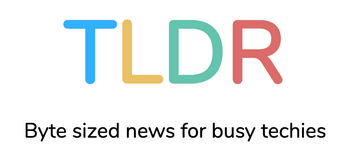

## Hi There, I'm Ishan.

I was fascinated by coding from a young age. I taught myself how to code from the ground up, and I have never stopped learning and exploring new possibilities.

Over the past ten years, I have worked on various projects that challenged me to grow as a coder and a problem-solver. I have learned how to build software that is reliable, scalable and performant, and that serves the needs of millions of users.

Thank you for visiting my blog, where I share my journey, thoughts, and experiences with you. I hope you find something useful and inspiring here. 

Currently, I am working on DDoS mitigation systems at Asians Group LLC. I have previously worked on systems and websites using OpenCV, Python, Django, PHP, Laravel, Vue, Eleventy, and many others. 

I'm also finally working towards a Bachelor's Degree in Data Science and Applications from the [Indian Institute of Technology, Madras](https://study.iitm.ac.in/ds/).

The beautiful photo was taken by my friend Sabyasachi Das in scenic Pondicherry, India.

## Featured In

  

## About This Website

This website is the latest iteration [of many](/blog/2023-06-20-hello-world/).

## FAQs
###  How do you deal with bugs that just won’t budge? Do you bribe them?
Yep, you caught me. I bribe them. I'm dirty.

###  Do you have a secret coding dance that boosts productivity?
It's more of a secret keyboard rhythm that syncs perfectly with the code’s heartbeat. Sadly, no dance moves... yet.

### How do you manage to stay sane during those long debugging sessions?
Insanity is relative! But seriously, music, memes, and the occasional staring contest with the screen keep me going.

### How can I subscribe to updates from your site?
You can subscribe to updates [via RSS](/feeds/blog/) or you could subscribe to the [newsletter](/newsletter/) instead.

### What did you use to make this website?
This website is made with Hugo, using the excellent [Stack](https://stack.jimmycai.com) theme with my own [customizations](https://github.com/sad-pixel/hugo-theme-stack/).

### What other blogs do you like?
Too many to list! Maybe one day I will try to collate them.

### What is the best programming language?
Haskell, obviously.

### Is it true you've had staring contests with your code? Who won?
It's a tie between me and the code; we both blinked and then had to debug why.

### Do you believe in horoscopes?
Absolutely! My horoscope for today: "You will encounter a syntax error, but fear not, for the solution is just a semicolon away!"

### Why do you hate SPAs?
I don't necessarily hate SPAs - I just believe there is a right and a wrong time to SPA.

### Why do you hate Javascript?
Ecosystem catch-up overload. I don't hate Javascript - but it's hard to keep up with all the happenings.

## Elsewhere