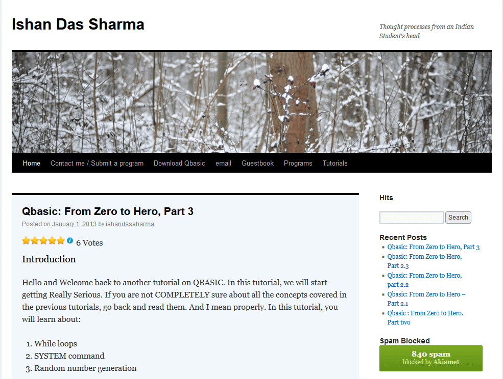
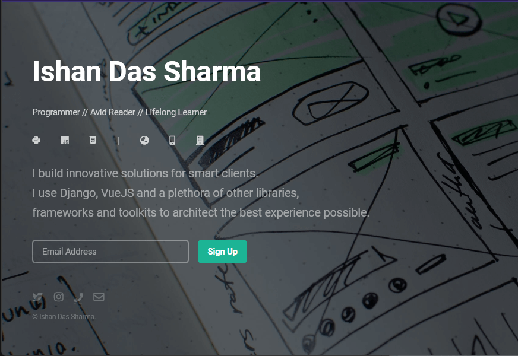

Many people who know me ask me why I haven't got a personal website or blog. I often don't know what to tell them. It's certainly not for a lack of trying.

Here's one of the very first blogs I started to help my 7th grade classmates learn programming which they weren't able to understand in school:

I fumbled around various other blogs, but never managed to be able to post consistently. I was either too lazy, having other things going on in life, or just plain scared that people would judge me. (this also explains why my [github](https://github.com/sad-pixel/) is so sparse, but I plan to change that soon)

I  settled for having a sweet and simple landing page, based on a theme from HTML5Up:

While decidedly amateurish and minimal, it's also woefully out of date (I last used VueJS in 2019). So, it's time for a refresh.

## Goals and wishes
* Rescue old blog posts from whatever previous blogs I have in my backups and post them here
* A "Projects" section where I can post my projects and project related writeups
* Have fun indieweb and fediverse things
* Add a proper RSS feed and webmentions support
* A "Grimoire" where I can post code snippets and quick explainers for my future self
* Semi-regular blog posting frequency (fingers crossed!)

Is this an ambitious list? Probably. But that's okay. Let's see how it goes. I'm excited to see what the future holds for me.

{}
