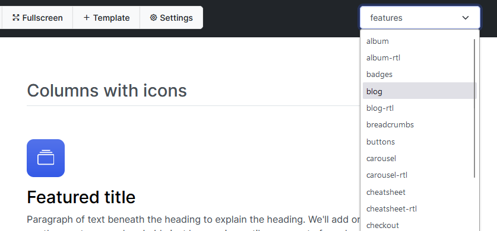

> Featured Photo by [energepic.com](https://www.pexels.com/photo/tool-set-on-plank-175039/)

I've had a love-hate relationship with Bootstrap for a long time. While I love how fast it lets me get going, I absolutely hate the cookie cutter vibe of most of the stuff that I end up making with it. [Bootswatch](https://bootswatch.com) is awesome, and I know that I _could_ customize my theme with SASS variables, but that adds a build step, which is additional complexity that I want to avoid when I am making business/CRUD applications.

Back in the Bootstrap 3 days, there used to be a customizer. I've found ones around for Bootsrap 4 as well, but nothing that I quite liked, so I decided to built my own.

## The Preview Window

When I'm tweaking a theme, I'd like to have a preview of the theme on a page. The official Bootstrap examples are great for this. I downloaded the examples from the official website and stored them in a folder. 

Then I used AlpineJS to create a dropdown menu where users could select an example and it would load the file in an `iframe`.

```html
<!DOCTYPE html>
<html lang="en">
    <!-- ... -->

<body x-data="{example: ''}">
    <!-- In Navbar -->
    <select x-model="example">
        <option value="/examples/cheatsheet">cheatsheet</option>
        <option value="/examples/blog">blog</option>
    </select>

    <!-- In Body -->
    <iframe x-bind:src="example"></iframe>

    <!-- Alpine -->
    <script src="//unpkg.com/alpinejs" defer></script>
</body>
</html>
```

IT WORKS!  
At this point, all I need to do is populate the `select` and I'll be good. 

Just one snag though - Since this was a rough prototype all in one file, I'd have to hardcode the options in. I thought about using `template` and `x-for`, but it felt like way too much effort.

That was the moment I caught myself typing the following command into my shell:

```bash
ls | 
jq -R -r '"<option value=\"/examples/" + . + "/\">" + . + "</option>"'
```
It gave me exactly what I wanted:
```html
<option value="/examples/album/">album</option>
<option value="/examples/album-rtl/">album-rtl</option>
<option value="/examples/badges/">badges</option>
<option value="/examples/blog/">blog</option>
<option value="/examples/blog-rtl/">blog-rtl</option>
<option value="/examples/breadcrumbs/">breadcrumbs</option>
<!-- ... many more -->
```

Copy paste it in, and my switcher works!



## Oh Dear..
Yes, that's right – I used `jq`, in a manner that might raise a few eyebrows. In hindsight, it felt like trying to hammer a nail with a wrench – a bit unconventional, to say the least.

Breaking down this command, `ls` is listing the files and directories, and the output is piped (`|`) to `jq`. The `-R` and `-r` flags are employed to input and output raw strings without JSON formatting. Inside the jq command, there's an attempt to generate HTML `<option>` elements by string manipulation.

This quirky misuse of `jq` in a scenario where a more traditional tool like `awk` would have been a more fitting choice was both amusing and insightful. After I was done guffawing at what I had just done, I reflected on what just happened. It was a humorous reminder of how our coding environment can shape our thought processes. 

As the saying goes:  

> To a man with a hammer (jq), everything looks like a nail (JSON).

## Immersion and Learning
I love learning by immersion. It's the best way for me to learn anything. 

When I immerse myself in a new topic, language, or skill, I feel like I'm absorbing it faster and deeper than any other method. 

I enjoy the challenge of figuring things out on my own. I also like the feeling of being part of a community that shares my interest and passion.

Learning by immersion is fun, rewarding, and effective for me.

## Side-effects of Immersion
I was so obsessed with `jq` that I didn't even realize I was using it for everything, like fitting a square peg through a round hole. 

It started when I decided to write [the ultimate interactive guide for jq](/blog/2023-11-06-jq-by-example/), I wanted to cover every aspect of it, from the basics to the advanced features. 

I spent hours and hours reading the documentation, experimenting with different filters, and testing various scenarios. The article languished for months because I wanted it to be perfect.

I learned a lot, but I also got hooked. I started to use `jq` for every task that involved JSON, even when it was not necessary or optimal. I just loved how `jq` made it easy and fun to work with JSON. 

`jq` is a great tool, but it is not the only tool. I had become too attached to `jq`, and I had lost sight of the bigger picture. I needed to take a step back and reevaluate my choices. That's how I ended up using `jq` because I had been so caught up with immersing myself.

## The Struggle To Keep An Open Mind

Sometimes I wonder if I'm too attached to my own way of thinking.

It's easy to fall into the trap of applying the same solution to every problem, or seeing the world through a narrow lens. But I don't want to be that kind of person. 

I want to keep an open mind and learn from different perspectives. I want to challenge myself and grow as a human being. That's why I try to expose myself to new ideas and experiences, even if they make me uncomfortable or confused at first. 

I think that's the only way to avoid becoming stagnant and rigid in my mindset.

## Awk is Scary
I don't know about you, but I will confess that I find `awk` kind of scary. 

It's a powerful tool for text processing, but it has a weird syntax and a lot of quirks. 

I'm usually just copy-pasting the one-liners from StackOverflow when I use `awk`, and I'm not sure what it will do or if it will backfire. 

Maybe I just need more practice, but awk is not my favorite thing to use.

But this _is_ where it would have been more appropriate. 

```bash
ls | 
awk '{ print "<option value=\"/examples/" $0 "/\">" $0 "</option>" }'
```

This awk command constructs HTML` <option>` elements from each line of the `ls` output, effectively achieving the desired result with a tool more suited for text manipulation.

## Closing Thoughts

So, that's how I ended up using `jq` to generate HTML options from a list of files. 

It was a silly but fun moment that made me realize how much I rely on this tool for everything JSON-related. 

But it also reminded me that sometimes, the best tool for the job is not the one you're most familiar with, but the one that suits the task at hand. 

In tech, we often face problems that require us to think outside the box and use tools in creative or unconventional ways. That's why it's important to have a flexible and curious mindset that allows us to learn new skills and explore different solutions. 

I hope you enjoyed reading this post. Do you have any stories of using tools in unexpected ways or finding solutions in surprising places? [Tell me all about it!](mailto:hello@ishan.page)